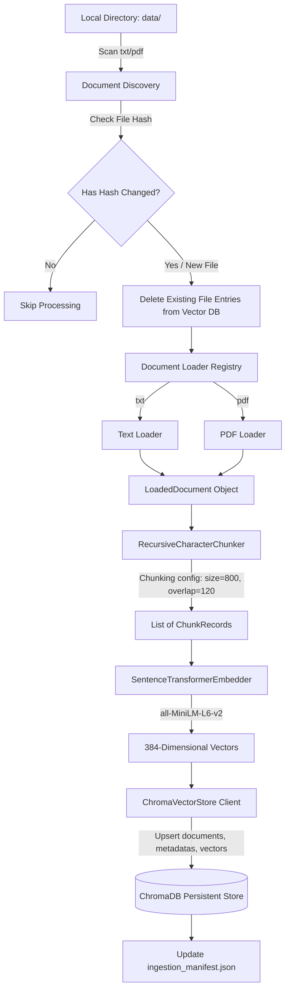

# Technical Architecture & System Design: Vulnerability RAG Assistant

This document provides a deep-dive technical explanation of the architecture, data flow, mathematical concepts, and component implementations that power the Vulnerability Management RAG Assistant.

---

## 1. System Architecture Diagram

The system operates in two distinct phases: **Ingestion (Offline)** and **Retrieval & Query (Online)**.

### A. Document Ingestion Flow (Offline Phase)
This flow discovers, parses, chunks, embeds, and stores local security documents incrementally.



### B. Query & Retrieval Flow (Online Phase)
This flow intercepts user queries, searches the vector database, constructs contextual prompts, and queries Gemini.

```mermaid
flowchart LR
    User([User Web UI]) -->|Query text| API[FastAPI: /api/query]
    API -->|1. Generate query vector| EMB[SentenceTransformerEmbedder]
    EMB -->|384-d Embedding| VDB[(ChromaDB Persistent Store)]
    VDB -->|2. Cosine similarity query| RET[RetrievalService]
    RET -->|List of retrieved chunks| PB[Prompt Context Builder]
    PB -->|Formatted context & prompt| LLM[GeminiLLMClient]
    LLM -->|3. Call Generate Content API| GEM[google-genai SDK]
    GEM -->|4. Answer text response| API
    API -->|JSON Response: Answer & matched chunks| User
```



---

## 2. In-Depth Component Specifications

### A. Core Configurations & Manifest
* **File Reference**: [config.py](file:///C:/RAG%20implementation/config.py)
* **Configuration State**: Stores project root directories, database paths, manifest paths, and LLM parameters (model names, temperature, APIs).
* **Incremental Synchronization**: The ingestion process maintains `vector_db/ingestion_manifest.json` as a map of `{ "filename": "SHA-256-hash" }` loaded/saved by [manifest.py](file:///C:/RAG%20implementation/src/utils/manifest.py).
  * During ingestion, if a file's computed hash matches the manifest, it is skipped.
  * If a file is modified, its old chunks are deleted by calling `delete_by_source_filename` in [chroma_store.py](file:///C:/RAG%20implementation/src/vectordb/chroma_store.py#L30) before processing the new content.
  * Any files removed from the directory are detected by set difference and deleted from ChromaDB.

### B. Loaders & Document Parser Registry
* **File Reference**: [registry.py](file:///C:/RAG%20implementation/src/loaders/registry.py)
* **Design Pattern**: Registry Pattern matching filesystem suffixes with specific implementations.
* **Text Loader**: Parses plain-text files. See [txt_loader.py](file:///C:/RAG%20implementation/src/loaders/txt_loader.py).
* **PDF Loader**: Uses `pypdf`'s `PdfReader` to extract textual components page-by-page. See [pdf_loader.py](file:///C:/RAG%20implementation/src/loaders/pdf_loader.py).

### C. Text Segmentation (Chunking)
* **File Reference**: [splitter.py](file:///C:/RAG%20implementation/src/chunking/splitter.py)
* **Class**: [RecursiveCharacterChunker](file:///C:/RAG%20implementation/src/chunking/splitter.py#L14)
* **Algorithm**: Sliding window using character lengths.
  $$\text{Next Start Offset} = \max(\text{Previous End} - \text{Overlap}, \text{Previous Start} + 1)$$
  This ensures smooth overlap boundaries to maintain text coherency across splits.

### D. Semantic Embeddings & Dense Retrieval
* **File Reference**: [model.py](file:///C:/RAG%20implementation/src/embeddings/model.py)
* **Model Model**: `all-MiniLM-L6-v2` (384-dimensional dense vectors).
* **Optimization**: The model object instantiation is cached via Python's `@lru_cache` to minimize initialization latency on hot paths.
* **Database Connection**: Persists vector indexes in standard folder-based SQLite and Parquet database formats via ChromaDB's persistent client. See [chroma_store.py](file:///C:/RAG%20implementation/src/vectordb/chroma_store.py).

---

## 3. Mathematical Foundations: Distance Metric

The ChromaDB collection is configured with cosine distance metric (`hnsw:space: cosine`):
* **Cosine Similarity** measures the cosine of the angle between two multi-dimensional vectors $A$ and $B$:
  $$\text{Cosine Similarity}(A, B) = \frac{A \cdot B}{\|A\| \|B\|} = \frac{\sum_{i=1}^{n} A_i B_i}{\sqrt{\sum_{i=1}^{n} A_i^2} \sqrt{\sum_{i=1}^{n} B_i^2}}$$
* **Cosine Distance** (stored and returned by ChromaDB as `distance`) is computed as:
  $$\text{Cosine Distance}(A, B) = 1 - \text{Cosine Similarity}(A, B)$$
* **Interpretation of Distance Scores**:
  * $0.0$: Identical direction (semantically closest).
  * $1.0$: Orthogonal direction (semantically unrelated).
  * $2.0$: Opposite direction.
  * Low distance values in the sidebar indicate high relevance to the question.

---

## 4. API Endpoints and Interface

### A. FastAPI Server
* **File Reference**: [app.py](file:///C:/RAG%20implementation/app.py)
* **Endpoint**: `/api/query` (POST)
  * **Payload Request**:
    ```json
    { "question": "What is SQL Injection?" }
    ```
  * **Payload Response**:
    ```json
    {
      "answer": "SQL Injection occurs when...",
      "chunks": [
        {
          "source": "dbir_2025.txt",
          "chunk_id": 5,
          "distance": 0.2319,
          "text": "..."
        }
      ]
    }
    ```

### B. Frontend Architecture
* **File Reference**: [App.jsx](file:///C:/RAG%20implementation/frontend/src/App.jsx)
* **Core React Hooks**:
  * `useState` tracks queries, conversational messages, database source chunks, and active UI highlights.
  * `useRef` automatically scrolls the conversation view on stream generation.
* **Component Split**:
  * Left Console: Interactive chat UI showcasing formatted Markdown queries, loaders, and action buttons.
  * Right Sidebar: Dynamic source document viewer displaying metadata cards. Selecting card highlighting syncs source text reference.
